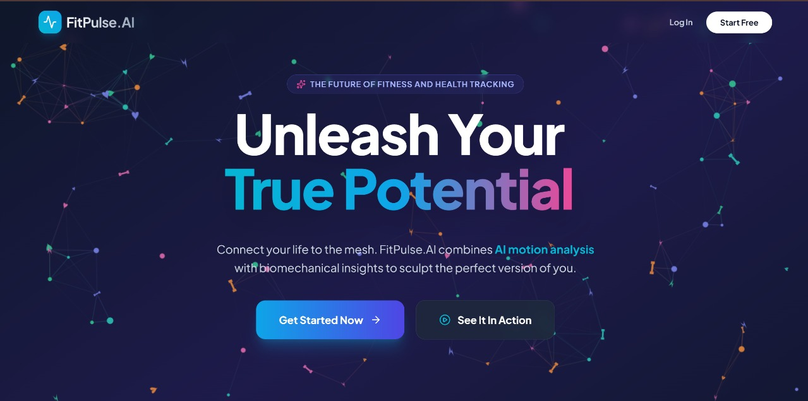

# 💪 FitPulse – AI-Powered Fitness & Health Platform

<div align="center">

**Your Personal AI Fitness Coach & Health Companion**

[]()
[]()
[]()
[]()

[](https://reactjs.org/)
[](https://www.typescriptlang.org/)
[](https://vitejs.dev/)
[](https://tailwindcss.com/)
[](https://google.github.io/mediapipe/)
[](https://tesseract.projectnaptha.com/)
[](https://firebase.google.com/)


</div>

---

## 🎯 What is FitPulse?

**FitPulse** is an AI-powered fitness and health platform that combines **real-time posture correction, workout safety, nutrition analysis, and wellness intelligence** into one unified system.

Unlike traditional fitness apps that only track workouts, FitPulse focuses on **safe, adaptive, and preventive wellness**, running **directly in the browser with no paid APIs required**.

---

## ❗ Problem We Address

* Incorrect workout posture leading to injuries
* No safety system for people exercising alone at home
* Nutrition labels are difficult to understand
* Generic workouts that ignore stress and fatigue
* Multiple disconnected apps for fitness, food, and health

---

## 💡 Our Solution

FitPulse unifies **fitness + health + safety** by offering:

* AI-based posture correction and rep counting
* Emergency safety through voice detection
* OCR-based nutrition understanding
* Stress-adaptive workout recommendations
* Preventive health awareness instead of reactive care

---

## 📱 Screenshots

### Fitness Dashboard


* Real-time pose detection with skeleton overlay
* Automatic rep counting
* Form issue warnings
* Emergency voice detection indicator

---

### Health Dashboard


* Food label scanner with OCR
* Nutrition facts display
* Diet suitability scoring
* Habit management

---

### Landing Page



* Clean onboarding experience
* Clear value proposition
* Quick access to core features

---

### Reports & Analytics *(Feature-ready)*

* Weekly progress reports
* Achievement tracking
* Improvement recommendations
* Workout distribution charts

---

## ⭐ Core Features

### 🏋️ Fitness & Safety

* **AI Posture Detection & Form Correction**
* **Automatic Rep Counting**
* **Post-Workout Visual Summary**
* **Virtual Spotter (“HELP” keyword detection)**
* **Emergency Assistance Prompt**

### 🍎 Nutrition & Health

* **Food Label Scanner (OCR)**
* **Diet Suitability Checker**

### 🧠 Wellness Intelligence

* **Stress-Adaptive Workouts**
* **Overtraining Detection**

---

## 🛠️ Tech Stack (Built using Kiro IDE)

### Frontend

* React 19
* TypeScript
* Tailwind CSS
* HTML Canvas API

### AI / ML

* **MediaPipe Pose** – posture & rep detection
* **Tesseract.js** – nutrition OCR
* **Web Speech API / Vosk / Picovoice** – voice safety
* **Rule-based intelligence** – adaptive workout logic

### Backend

* Firebase (Authentication & Firestore)

🔒 **Client-side AI ensures privacy & low latency**

---

## 🚀 Quick Start

### Prerequisites

* Node.js 18+
* Modern browser (Chrome, Edge, Firefox, Safari)
* Webcam (pose detection)
* Microphone (Virtual Spotter)

### Installation

```bash
git clone <your-repo-url>
cd fitpulse
npm install
npm run dev
```

Visit 👉 **[http://localhost:5173](http://localhost:5173)**

---

## 🎮 How to Use

### Start a Workout

Dashboard → Launch Session → Fill Feedback → Select Exercise → Start

### Scan Food Labels

Health Dashboard → Scan Food Label → Take Photo → View Results

### Set Habits

Health Dashboard → Habits → Enable Notifications → Toggle Habits

### View Progress

Fitness Dashboard → Weekly Report → See Stats & Achievements

---

## 🔒 Privacy & Security

* Pose detection runs **locally**
* OCR processing is **client-side**
* No external speech services required
* User data stored securely using Firebase
* No third-party analytics or tracking

---

## 🌐 Browser Support

| Browser | Pose | Voice      | OCR | Notifications |
| ------- | ---- | ---------- | --- | ------------- |
| Chrome  | ✅    | ✅          | ✅   | ✅             |
| Edge    | ✅    | ✅          | ✅   | ✅             |
| Firefox | ✅    | ⚠️ Limited | ✅   | ✅             |
| Safari  | ✅    | ⚠️ Limited | ✅   | ⚠️ Limited    |

---

## 📦 Project Structure

```
src/
├── components/      # UI components
├── utils/           # AI logic & helpers
├── pages/           # Fitness & Health dashboards
├── contexts/        # Authentication context
└── types.ts
```

---

## 🚀 Deployment

```bash
npm run build
npm run preview
```

Deploy the `dist/` folder to:

* Vercel
* Netlify
* Firebase Hosting
* GitHub Pages
* AWS S3 + CloudFront

---

## ⚖️ Comparison: Popular Fitness Apps vs FitPulse

| Feature            | Popular Apps | FitPulse  |
| ------------------ | ------------ | --------- |
| Posture Correction | ❌            | ✅         |
| Rep Counting       | ⚠️ Limited   | ✅         |
| Emergency Safety   | ❌            | ✅         |
| Nutrition OCR      | ❌            | ✅         |
| Stress Adaptation  | ❌            | ✅         |
| Fitness + Health   | ❌ Separate   | ✅ Unified |
| Privacy-first AI   | ❌            | ✅         |

👉 **No mainstream app currently offers this complete combination.**

---

## 🌍 Real-Life Impact & Outcomes

### Impact

* Safer workouts with fewer injuries
* Fitness accessible to beginners and older adults
* Improved food and health awareness

### Outcomes

* Stress-adjusted workout routines
* Early warnings for overtraining
* Emergency safety during home workouts

### Achieves in Real Life

* Prevents burnout and long-term injuries
* Encourages healthier daily habits
* Replaces multiple fitness & health apps

---

## 🌍 Why Open Innovation Track?

* Solves real-world fitness + healthcare gaps
* Combines AI, safety, and wellness
* Platform-agnostic and scalable
* Focused on preventive and inclusive care

---

## 👥 Team – Team Jugaadu

* Vishal Gowda
* Deepkumar Das
* Pranav Shirke
* Gideon Mire

---

## 📌 Final Note

FitPulse is not just a fitness app —
it is a **preventive, intelligent, safety-first wellness companion**.

> **That’s how we’re shaping FitPulse to be intelligent and safe.**
